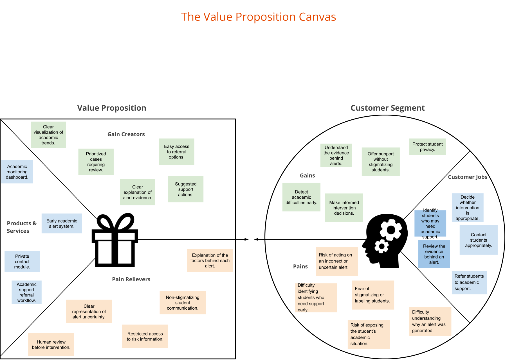

# Early Warning System for Academic Risk with Faculty Review

## 1. Team Identification and Roles
* **Leonardo Castellón** — Team Lead
* **Cristóbal Ramos** — Systems & Data Analyst
* **Héctor Rosales** — UX/UI Designer

---

## 2. Problem Statement & Proposed Solution Scope

### Problem Statement
Educational institutions calculate academic risk indicators based on attendance, grades, and platform usage. However, algorithmically labeling a student as "at risk" carries significant social side effects: public stigmatization, self-fulfilling prophecies, and unintended disciplinary actions. 

The challenge involves two main stakeholders with distinct needs—academic directors seeking timely intervention without labeling students, and students seeking discreet support without feeling judged or exposed. Furthermore, the underlying algorithmic model is inherently fallible and contains uncertainty. The design must resolve what information is shown to whom, how algorithmic uncertainty is transparently expressed, and what concrete, empathetic actions are enabled.

### Solution Overview
We propose an empathetic, privacy-first academic support platform. Instead of exposing public risk tags or automated disciplinary notices, the solution provides academic directors with uncertainty-aware risk dashboards and non-stigmatizing communication templates. Students gain access to a private self-management portal where they can check their status and discreetly request tutoring support without fear of public exposure.

---

## 3. Scope Delimitation & Justification

To maintain architectural consistency, traceability, and prevent functional overload, the system scope is strictly delimited to **one primary flow** and **two secondary flows**.

### Included Flows
* **Primary Flow (Main):** *Early Risk Identification & Confidential Empathetic Outreach (Academic Director)*
  * The Academic Director views student risk indicators alongside algorithmic certainty/uncertainty levels. They initiate contact using predefined, empathetic message templates without triggering punitive warnings.
* **Secondary Flow 1:** *Private Academic Status Tracking & Discrete Help Request (Student)*
  * The student accesses a private view of their academic indicators, attendance, and progress, and can discretely request academic assistance/tutoring without feeling judged.
* **Secondary Flow 2:** *Discrete Tutoring Request Management & Student Support (Peer Tutor)*
  * Peer tutors receive anonymized or discreet tutoring assignments based on subject difficulty patterns, keeping the student's overall risk status completely confidential.

### Out of Scope (Justification)
* **Direct Course Teacher / Instructor View & Workflow:** Course-level instructors are explicitly excluded from this iteration to prevent potential classroom bias, unintentional labeling, and privacy leaks during lectures.
* **Automated Sanctions / Disciplinary Actions:** The system deliberately omits automated disciplinary notices, warning letters, or administrative penalty workflows to avoid punitive outcomes.
* **Direct Grade Book Modification:** The platform does not alter institutional grade registers or official transcripts.

---

## 4. UX Research & UX Elements Framework

Each UX Research technique implemented in this project maps directly to standard UX Elements:

1. **Strategy (Estrategia):** User Needs Analysis via 3 detailed UX Personas (Academic Director, At-Risk Student, Peer Tutor) and a Value Proposition Canvas balancing pains, gains, and feature sets.
2. **Scope (Alcance):** Benchmark comparison and functional specification defining core feature boundaries (empathetic outreach, uncertainty visualization, private tutoring referral).
3. **Structure (Estructura):** Information architecture mapping the primary flow for Directors and secondary flows for Students and Tutors.
4. **Skeleton (Esqueleto):** Wireframes and UI layouts incorporating algorithmic confidence indicators, non-punitive messaging modals, and confidential request buttons.
5. **Surface (Superficie):** Visual design UI implementation focused on neutral language, non-threatening color palettes, and clear visual hierarchy.

---

## 5. Value Proposition Canvas

### Value Proposition Canvas
The Value Proposition Canvas bridges user pains/gains with system features, emphasizing algorithmic transparency, discrete support, and non-stigmatizing communication templates.

---

### 6. UX Personas

#### 1. Claudio Novarro — Academic Director (Director de Carrera)
* **Goal:** Early, confidential intervention with students needing academic support without exposing or stigmatizing them.
* **Pains:** Fear of acting on algorithmic false positives; lack of early indicators; fear of causing student embarrassment.
* **Needs:** Clear risk dashboards with explicit uncertainty indicators and ready-to-use empathetic outreach templates.

---

#### 2. José Pérez — First-Year Student (Estudiante)
* **Goal:** Easily track grades and attendance while privately obtaining academic help.
* **Pains:** Anxiety regarding threatening warning emails; fear of being labeled as a "bad student".
* **Needs:** A non-judgmental, private portal to track progress and request discrete tutoring.

---

#### 3. León Castillo — Peer Tutor (Tutor / Alumno Senior)
* **Goal:** Help junior students pass early computer science subjects and reduce help-seeking friction.
* **Pains:** Students seeking help too late in the semester due to stigma and isolation.
* **Needs:** A privacy-preserving mechanism to receive tutoring requests and focus on subject difficulties.

