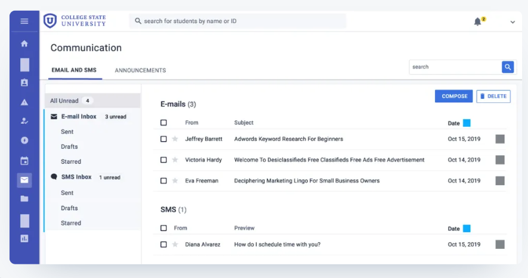
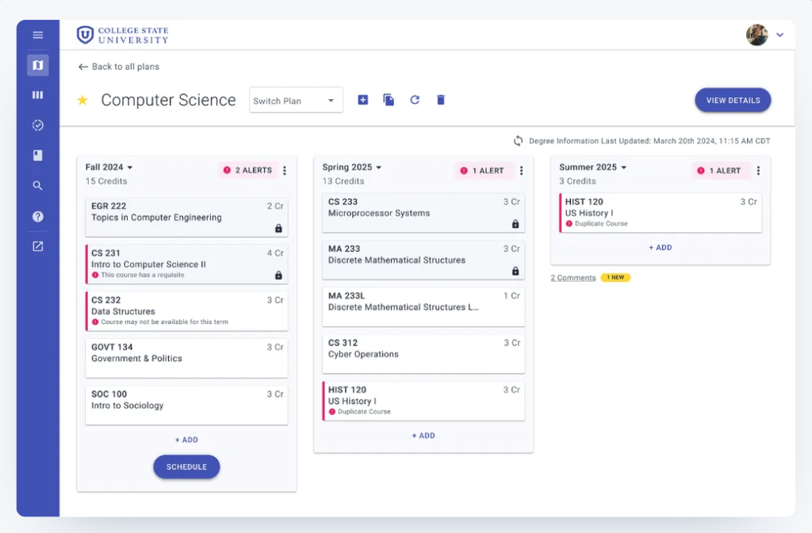
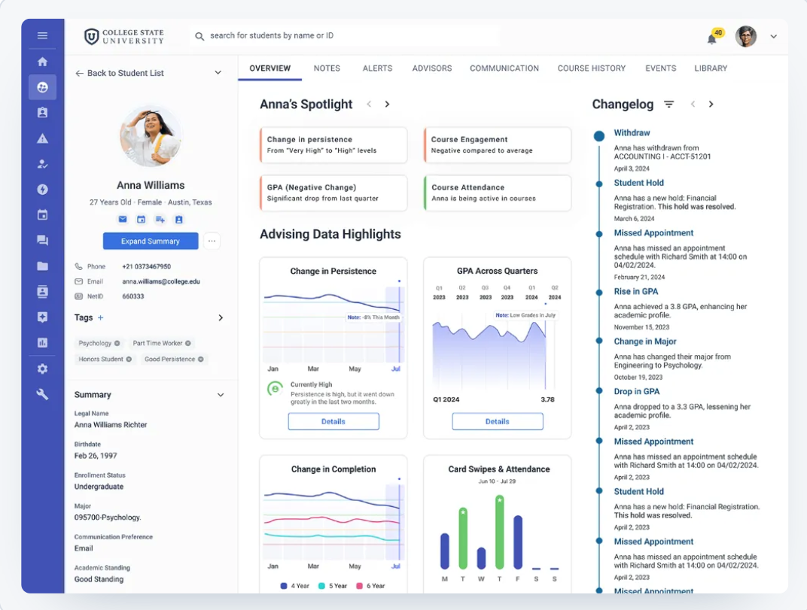

# 01 - Tool Analysis: Civitas Learning & RNL Retention System (Direct Competitor)

> **Benchmark Phase:** Phase 1 — Initial Exploration
> **Analysis Date:** October 2026
> **Layer (Garrett):** Strategy & Scope

---

## 1. Tool Identification
* **Tool Name:** Civitas Learning Student Success Platform / RNL Retention Management System
* **Platform:** Web Application (SaaS / Enterprise System)
* **Analyzed Version / Date:** Web Platform Analytics v2026 / Captured October 2026
* **URL:** https://civitaslearning.com/
* **Category:** Direct Competitor — Predictive retention analytics for higher education

---

## 2. Target User Profile & Value Proposition
* **Target User:** Academic Directors, Program Leads, Retention Officers, Academic Advisors.
* **Value Proposition:** Uses predictive analytics and generative AI assistants to identify student academic risk, calculate retention trends, and help advisors draft outreach messages.

---

## 3. Core Features & User Flows
* **Main Feature Map:**
  1. Student Risk Profile & Retention Trend Dashboard.
  2. Generative AI Conversational Assistant for Email Drafting.
  3. Predictive Risk Score Breakdown (Grades, LMS activity, attendance).
* **Onboarding Flow:** Enterprise single sign-on (SSO) with role-based administrative setup.
  * *Analysis:* Onboarding is fully institution-gated; no student-facing entry point exists. Setup requires administrative provisioning and data-source integration before any value is delivered. **→ Gap PLANAG/PLANAC exploits:** our proposal can deliver value from day one on the student side without institutional data integration.
* **Navigation Pattern:** Left vertical sidebar navigation with tabbed dashboard views and multi-column student tables. Depth: 3–4 levels typical for advisor drill-down into individual profiles.
* **Visual Design & Consistency:** Standard corporate SaaS aesthetic; blue and neutral gray palettes with colored status badges. Visually consistent, but status color semantics (red/yellow) dominate the visual hierarchy.

---

## 4. Observable Accessibility
* **Contrast Ratio:** Standard text elements satisfy WCAG 2.1 AA contrast ratios (4.5:1 minimum against light backgrounds).
* **Keyboard Navigation:** Form fields and navigation links support standard keyboard focus outlines (Tab key order is preserved across table structures).
* **Screen Reader Compatibility:** High-contrast badges include text labels, though dynamic AI panel overlays lack ARIA live regions for automated screen reading. **→ Gap:** AI-generated suggestions are not announced to screen reader users.

---

## 5. Domain-Specific Dimensions

### 5.1 Algorithmic Certainty
Displays explicit predictive probability indexes and risk scores without explaining incomplete data sources or model margin of error.
* **→ PLANAG/PLANAC positioning:** We explicitly avoid numeric risk indexes and replace them with qualitative wording ("3-week trend", "incomplete data") so advisors never over-trust a single score.

### 5.2 Communication Tone & Stigma
Integrates Generative AI assistants to help program directors suggest tone and draft empathetic follow-up emails, avoiding aggressive templates.
* **→ PLANAG/PLANAC positioning:** We adopt the empathetic intent but remove the generative unpredictability — our templates are predefined, reviewed, and non-punitive by design.

### 5.3 Confidentiality & Help Request
Risk indicators are visible to advisors and directors, but students lack a private portal to discretely request assistance without being labeled.
* **→ PLANAG/PLANAC positioning:** Our core differentiating feature is a *discreet student self-request channel* — no public risk label, no third-party visibility, no stigma.

---

## 6. Annotated Screenshots Analysis

### Notable Strengths (Positive)

#### Screenshot 1 — Civitas Communication Hub (Centralized Outreach)

* **Annotation:** Highlight box around the "E-mails (3) and SMS (1) Centralized Inbox" and the "SMS Preview: How do I schedule time with you?" message.
* **Comment:** Unifies email and SMS into one timeline, preventing fragmented advisor–student communication.

#### Screenshot 2 — Civitas Academic Degree Planner & Course Friction

* **Annotation:** Highlight box around the aggregate course friction metrics and prerequisite alerts.
* **Comment:** Surfaces structural bottlenecks across semesters, not just individual student behavior.

#### Notable Strength 3 — Inline Action Triggers
* **Justification:** Allows advisors to move directly from risk review to student contact without switching platforms.

---

### Areas for Improvement (UX Issues)

#### Screenshot 3 — Civitas Student Analytics Profile & Risk Predictions

* **Annotation:** Highlight box around "Advising Data Highlights (Change in Persistence / GPA Across Quarters)" and the "Changelog Timeline (Withdraw, Missed Appointment)".
* **Area for Improvement 1 — Heuristic: Error Prevention / Algorithmic Bias**
  Presents hard persistence levels ("High to Very High drop") without margin-of-error bounds, leading advisors to over-rely on fallible estimates.
* **Area for Improvement 2 — Heuristic: Recognition Rather Than Recall / Visual Stigma**
  Heavy reliance on red warning indicators ("! ALERT") and numeric risk percentages biases advisor check-ins and induces panic if seen.

---

## 7. Summary of Positioning vs. PLANAG / PLANAC

| Dimension | Civitas Learning | PLANAG / PLANAC Decision |
| :--- | :--- | :--- |
| Algorithmic Certainty | Explicit numeric risk scores, no error bounds | Qualitative trend wording; no numeric index |
| Communication Tone | Generative AI drafts, variable tone | Predefined empathetic templates, non-punitive |
| Confidentiality | Advisor/director visible, no student portal | Discreet self-request, no public exposure |
| Onboarding | Institution SSO, requires data integration | Student-side, low-friction, no integration needed |

---

## 8. Notes
* Captures taken October 2026 on Web Platform Analytics v2026.
* Screenshots annotated with highlight boxes and labels as per benchmark requirements (min. 3 per tool).
* All observations tied to Nielsen heuristics where applicable.
* This tool is classified as **Direct Competitor** because it solves the same problem (early detection of academic risk) for the same institutional user profile (advisors and retention officers).