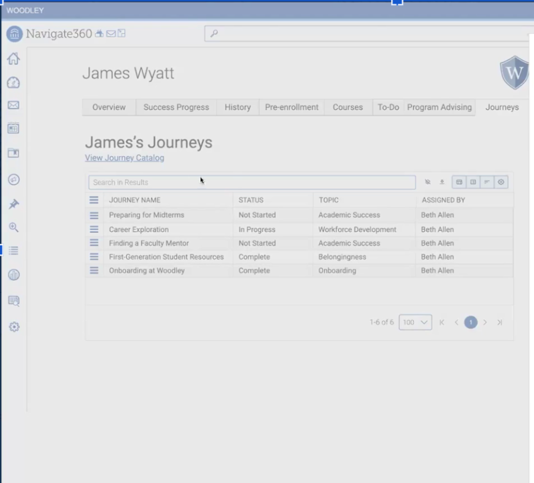
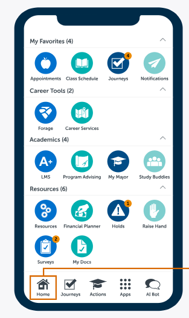
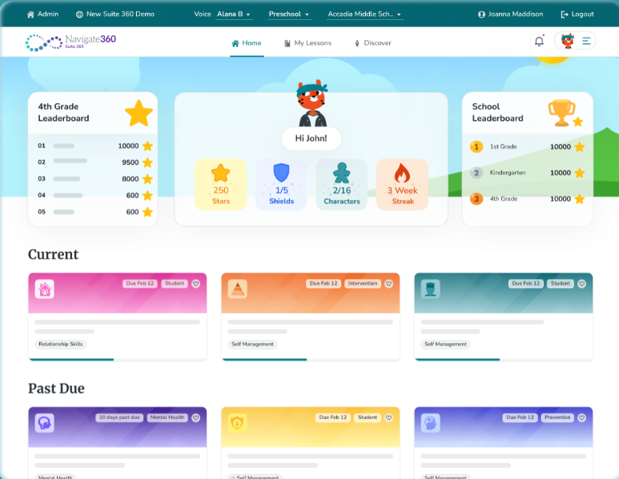

# 02 - Tool Analysis: EAB Navigate360 (Analog Competitor)

> **Benchmark Phase:** Phase 1 — Initial Exploration
> **Analysis Date:** October 2026
> **Layer (Garrett):** Strategy & Scope

---

## 1. Tool Identification
* **Tool Name:** EAB Navigate360 (Student Success Management System)
* **Platform:** Web Application & Mobile App
* **Analyzed Version / Date:** Enterprise Academic Release 2026 / Captured October 2026
* **URL:** https://eab.com/solutions/navigate360/
* **Category:** Analog / Direct Domain Competitor

---

## 2. Target User Profile & Value Proposition
* **Target User:** Course Instructors, Academic Advisors, Department Chairs, Students.
* **Value Proposition:** Combines instructor-raised alerts, automated progress reports, positive "Kudos" recognition, and referral case tracking to support student retention.

---

## 3. Core Features & User Flows
* **Main Feature Map:**
  1. Early Alert Raising (Attendance, Low Midterm Grades, Risk Flags).
  2. Positive Reinforcement Badges ("Kudos" for Academic Improvement).
  3. Support Case Management & Referral Workflows (Advising, Tutoring, Counseling).
  4. Closed-Loop Progress Tracking (Notifying faculty when a referral is closed).
* **Onboarding Flow:** Single Sign-On (SSO) with role-based access control.
  * *Analysis:* Onboarding requires institutional credentials; students and staff enter through the same gate. No standalone or guest access. **→ Gap PLANAG/PLANAC exploits:** students need a low-friction, mobile-first entry point that does not depend on institutional provisioning.
* **Navigation Pattern:** Tabbed dashboard views with left vertical navigation and pop-up action modals. Depth: 2–3 levels typical for alert-to-case drill-down.
* **Visual Design & Consistency:** Clean enterprise card UI, clear visual distinction between red alert flags and green kudos badges. Consistent internal color semantics but semantically overloaded (green = success, red = risk, but also gamified colors in student view).

---

## 4. Observable Accessibility
* **Contrast & Typography:** Strong typography hierarchy with text contrast exceeding WCAG AA standards across desktop views.
* **Touch Targets:** Touch targets on desktop views are appropriately sized (44x44px minimum); however, mobile grid views crowd multiple icon buttons together. **→ Gap:** crowded icon grid increases mis-tap risk on the student-facing mobile portal.
* **Screen Reader Compatibility:** Well-structured HTML data tables with appropriate headers for administrative keyboard navigation.

---

## 5. Domain-Specific Dimensions

### 5.1 Algorithmic Certainty
Focuses primarily on human-triggered flags and rule-based thresholds rather than black-box AI, though it lacks clear confidence bounds when displaying risk indicators.
* **→ PLANAG/PLANAC positioning:** We go further by making uncertainty explicit in the UI ("3-week trend", "incomplete data") instead of presenting risk as a fixed state.

### 5.2 Communication Tone & Stigma
Balances negative alerts with positive "Kudos". However, instructor-issued alerts can still trigger student anxiety if not worded empathetically.
* **→ PLANAG/PLANAC positioning:** We replace generic alert language with predefined *empathetic contact templates*, ensuring every outbound message is intentional and non-punitive.

### 5.3 Confidentiality & Help Request
Provides closed-loop updates so directors know contact occurred without revealing private conversation details to third parties.
* **→ PLANAG/PLANAC positioning:** We adopt the closed-loop idea but push it further with a fully *discreet student self-request channel* — no public risk labels, no peer exposure.

---

## 6. Annotated Screenshots Analysis

### Notable Strengths (Positive)

#### Screenshot 1 — Appointment Preparation Modal & Context Summary

* **Annotation:** Highlight box around the "AI Assistant side panel" with quick action buttons ("Send a message to this student" & "Help me prepare for an appointment") and the "Journeys Table".
* **Comment:** Centralizes progress notes, tutoring history, and external constraints into one prep panel for advisors.

#### Screenshot 2 — Navigate Student Mobile Portal

* **Annotation:** Highlight box around the "Raise Hand (Discreet Help Request)" icon and the "Study Buddies" feature.
* **Comment:** "Raise Hand" lets students self-request academic help quietly from their mobile device.

#### Notable Strength 3 — Closed-Loop Case Tracking
* **Justification:** Notifies referring instructors when a support case is completed without exposing private counseling details.

---

### Areas for Improvement (UX Issues)

#### Screenshot 3 — Gamified Student Dashboard (Suite 360)

* **Annotation:** Highlight box around "Gamified Progress Cards (Stars, Shields, Streaks)" and the "Intervention / Mental Health Module Badges".
* **Area for Improvement 1 — Heuristic: Consistency & Standards / Cognitive Overload**
  The mobile icon grid shows high visual clutter and competing calls-to-action, increasing cognitive load for students seeking help.
* **Area for Improvement 2 — Heuristic: Match Between System & Real World**
  Public leaderboards and competitive gamification ("School Leaderboards") generate unintended peer pressure and stigma in risk management.

---

## 7. Summary of Positioning vs. PLANAG / PLANAC

| Dimension | EAB Navigate360 | PLANAG / PLANAC Decision |
| :--- | :--- | :--- |
| Algorithmic Certainty | Human-triggered flags, rule-based, no confidence bounds | Qualitative trend wording; explicit uncertainty |
| Communication Tone | Mix of alerts + Kudos, not always empathetic | Empathetic templates only, non-punitive |
| Confidentiality | Closed-loop updates, role-limited | Discreet self-request, no public risk labels |
| Onboarding | Institution SSO, role-gated | Student-side, low-friction, mobile-first |

---

## 8. Notes
* Captures taken October 2026 on Enterprise Academic Release 2026.
* Screenshots annotated with highlight boxes and labels as per benchmark requirements (min. 3 per tool).
* All observations tied to Nielsen heuristics where applicable.
* This tool is classified as **Analog / Direct Domain Competitor** because it solves the same problem (student retention) for a partially overlapping user set (advisors + students) but through a different institutional model.