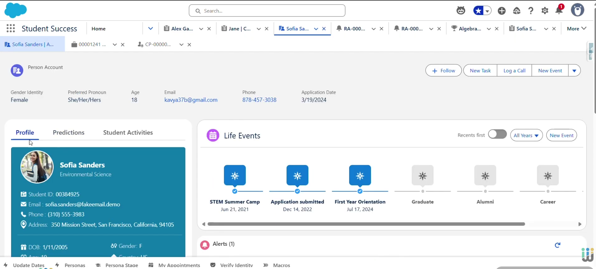
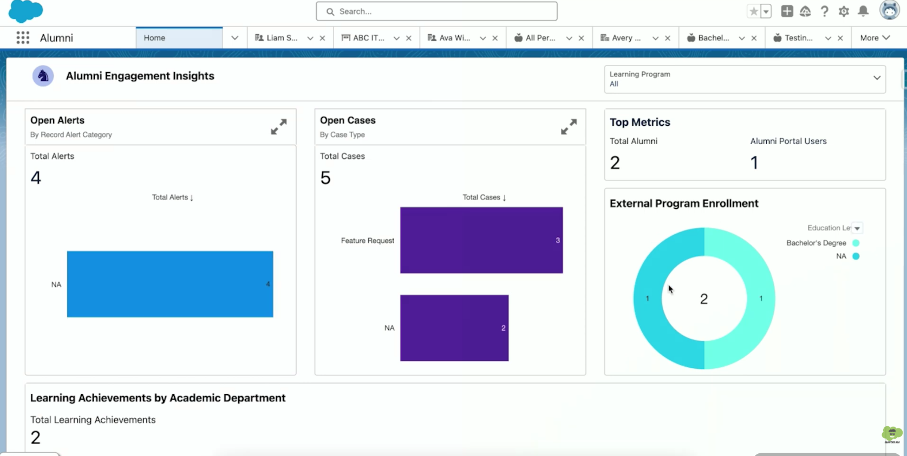
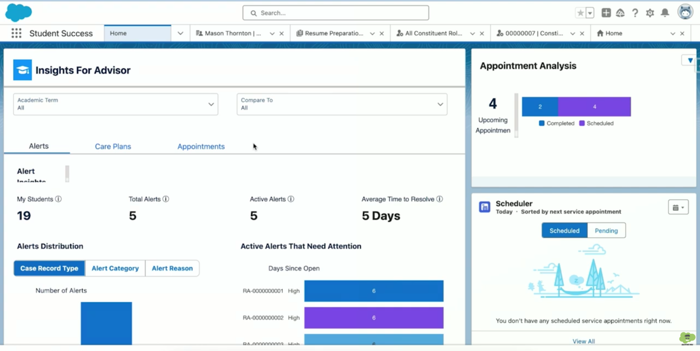

# 03 - Tool Analysis: Salesforce Education Cloud / Next-Gen SIS (Design Reference)

> **Benchmark Phase:** Phase 1 — Initial Exploration
> **Analysis Date:** October 2026
> **Layer (Garrett):** Strategy & Scope

---

## 1. Tool Identification
* **Tool Name:** Salesforce Education Cloud / Next-Gen Student Information System (SIS)
* **Platform:** Web Enterprise Platform & Cloud Dashboard
* **Analyzed Version / Date:** Higher Ed Release 2026 / Captured October 2026
* **URL:** https://www.salesforce.com/education/cloud/next-gen-sis/
* **Category:** Design Reference — Enterprise Academic Infrastructure & Student 360

---

## 2. Target User Profile & Value Proposition
* **Target User:** University Administrators, Career Directors, Student Success Teams, Academic Advisors.
* **Value Proposition:** Unifies academic history, engagement metrics, and administrative status into a single "Student 360" profile to streamline institutional advising workflows.

---

## 3. Core Features & User Flows
* **Main Feature Map:**
  1. Unified Student 360 Profile View (academic records, cases, interaction log).
  2. Integrated Case Management for Student Support Services.
  3. Multi-departmental Communication History & Contact Tracking.
* **Onboarding Flow:** Enterprise SSO authentication with granular role-based permissions.
  * *Analysis:* Onboarding is role-gated and requires institutional provisioning before first access — no self-service signup. This creates zero friction for pre-authorized staff but blocks any exploratory or student-initiated entry. **→ Gap PLANAG/PLANAC exploits:** a lightweight, student-side onboarding with no institutional dependency.
* **Navigation Pattern:** Left navigation sidebar with tabbed record views, activity timelines, and detail cards. Depth: 3–4 levels typical for case drill-down.
* **Visual Design & Consistency:** Professional enterprise UI, highly structured data fields, customizable dashboard widgets. Consistent internal system (Salesforce Lightning Design System), but visually dense.

---

## 4. Observable Accessibility
* **Contrast & Legibility:** High text contrast and keyboard-accessible enterprise data tables.
* **Mobile Responsiveness:** Web dashboards are dense and unoptimized for mobile screens, requiring reliance on dedicated mobile views for student interaction. **→ Gap:** no unified mobile-first student experience.
* **Screen Reader Compatibility:** High compliance in standard desktop views, though complex custom timeline widgets require improved ARIA labelling.

---

## 5. Domain-Specific Dimensions

### 5.1 Algorithmic Certainty
Focuses on historical activity logging rather than predictive risk scoring, presenting facts without explicit uncertainty modeling.
* **→ PLANAG/PLANAC positioning:** We reject raw historical dumps and instead surface *qualitative trend language* ("3-week decline", "incomplete data") rather than binary or numeric risk states.

### 5.2 Communication Tone & Stigma
Provides centralized messaging tools; however, notes and cases can become visible across multiple administrative departments if permissions are not strictly bounded.
* **→ PLANAG/PLANAC positioning:** We adopt predefined *empathetic contact templates* and avoid disciplinary or diagnostic tone entirely.

### 5.3 Confidentiality & Help Request
Tracks interaction history, but lacks a simplified, non-intimidating mobile interface for students to discretely self-request assistance.
* **→ PLANAG/PLANAC positioning:** Our core differentiating feature is a *discreet self-request channel* with no public risk labels or third-party exposure.

---

## 6. Annotated Screenshots Analysis

### Notable Strengths (Positive)

#### Screenshot 1 — Student 360 Profile & Life Events Timeline

* **Annotation:** Highlight box around the "Life Events Timeline (STEM Summer Camp, First Year Orientation)", the "Profile Card", and student history tabs.
* **Comment:** Timeline visualization gives rich contextual background without switching administrative systems.

#### Screenshot 2 — Alumni & Program Engagement Dashboard

* **Annotation:** Highlight box around "Open Cases By Case Type" graph and program enrollment metrics.
* **Comment:** Macro-level program visibility helps directors spot systemic bottlenecks across courses.

#### Notable Strength 3 — Role-Based Permission Model
* **Justification:** Granular role-based permissions ensure administrative data is restricted based on advisor roles.

---

### Areas for Improvement (UX Issues)

#### Screenshot 3 — Salesforce Advisor Insights Dashboard

* **Annotation:** Highlight box around "Active Alerts That Need Attention (Days Since Open)" and "Average Time to Resolve (5 Days)" metric.
* **Area for Improvement 1 — Heuristic: Flexibility & Efficiency of Use**
  Treats student support as ticket queues ("Days Since Open", "Time to Resolve"), prioritizing throughput over empathetic contact.
* **Area for Improvement 2 — Heuristic: Aesthetic & Minimalist Design**
  Extreme visual density creates a steep learning curve for directors needing rapid, actionable student insights.

---

## 7. Summary of Positioning vs. PLANAG / PLANAC

| Dimension | Salesforce Education Cloud | PLANAG / PLANAC Decision |
| :--- | :--- | :--- |
| Algorithmic Certainty | Historical logs, no uncertainty modeling | Qualitative trend wording; no numeric risk index |
| Communication Tone | Administrative / case-based | Empathetic templates, non-disciplinary |
| Confidentiality | Centralized logs, permission-dependent | Discreet self-request, no public exposure |
| Onboarding | Enterprise SSO, role-gated | Student-side, low-friction |

---

## 8. Notes
* Captures taken October 2026 on Higher Ed Release 2026.
* Screenshots annotated with highlight boxes and labels as per benchmark requirements (min. 3 per tool).
* All observations tied to Nielsen heuristics where applicable.