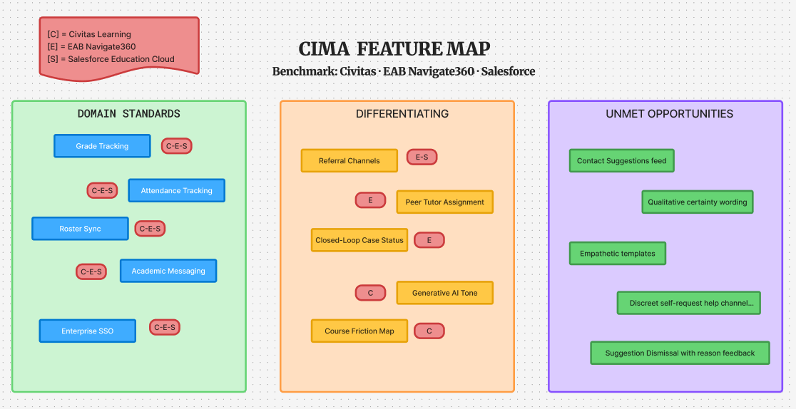
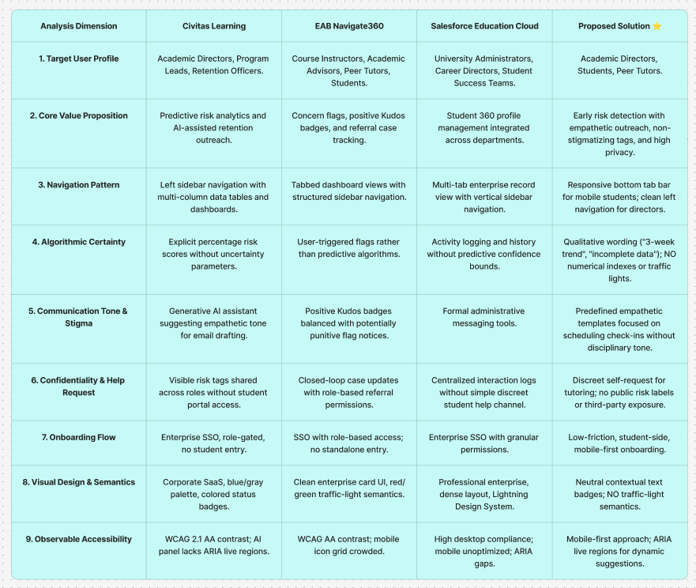

# 00 - Benchmark Summary & Synthetic Overview

> **Benchmark Phase:** Phase 1 → Updated in Phase 2
> **Analysis Date:** October 2026
> **Layer (Garrett):** Strategy & Scope
> **Status:** Living document — updated after Phase 2 design decisions (see file `04 - Benchmark Findings & Design Decisions`)

This document serves as the primary entry point for the competitive benchmark analysis conducted for **CIMA** (*Early Warning System for Academic Risk with Faculty Review*). Framed within Jesse James Garrett's **Strategy** and **Scope** layers, this study evaluates existing direct, analog, and design reference platforms to establish domain standards, spot design gaps, and justify our core solution scope.

---

## 1. Feature Map (Synthetic View)

The feature map categorizes system functionalities into **Domain Standards**, **Differentiating Features**, and **Unmet Opportunities** targeted by the PLANAG / PLANAC proposal. Each feature is traceable to its source tool (see files 01–03).

### 1.1 Domain Standards (present in all 3 tools)
* Grade & Attendance Tracking
* Basic Institutional Roster Sync
* Direct Academic Messaging / Standard Email
* Enterprise SSO Onboarding

### 1.2 Differentiating Features (present in 1–2 tools)
* Custom Support Referral Channels (DITFO, Psychology, Wellness) — Tool 02, Tool 03
* Anonymous & Aggregated Subject Difficulty Metrics — Tool 01
* Peer Tutor Assignment & Schedule Management — Tool 02
* Closed-Loop Case Status — Tool 02
* Generative AI Tone Assistance — Tool 01

### 1.3 Unmet Opportunities (absent in all 3 tools — PLANAG / PLANAC core proposal)
* "Contact Suggestions" feed instead of "At-Risk Student Lists"
* Qualitative Algorithmic Certainty Wording ("3-week trend", "incomplete data") without numerical indexes or traffic lights
* Predefined Empathetic Contact Templates with Student Schedule Choice
* Confidential & Discreet Student Help Requests without Public Exposure
* Automated Suggestion Dismissal with Reason Feedback for Continuous Model Learning

---

## 2. Synthetic Comparative Matrix

---

## 3. Features Explicitly Out of Scope

The following features were identified in competitor tools but are **deliberately excluded** from PLANAG / PLANAC. Full rationale in file `04 - Benchmark Findings & Design Decisions`.

* Multi-semester Degree Planner (Tool 01)
* Gamified Kudos / Public Leaderboards (Tool 02)
* Enterprise Case Management / Student 360 (Tool 03)
* Multi-Departmental Communication Logs (Tool 03)

---

## 4. Traceability Note

Every claim in the matrix above is supported by:
* An annotated screenshot in files 01–03 (minimum 3 per tool).
* A Nielsen heuristic reference (for improvement areas).
* A direct source citation from the tool's official documentation or live UI.

---

## 5. References

* Tool 01 – Civitas Learning Student Success Platform. See `01 - Tool Analysis Civitas Learning & RNL.md`.
* Tool 02 – EAB Navigate360. See `02 - Tool Analysis EAB Navigate360 (Analog.md`.
* Tool 03 – Salesforce Education Cloud. See `03 - Tool Analysis Salesforce Education Cloud.md`.
* Design decisions – See `04 - Benchmark Findings & Design Decisions.md`.
* Heuristics – Nielsen, J. (1994). *10 Usability Heuristics for User Interface Design*.
* Framework – Garrett, J. J. (2010). *The Elements of User Experience*.